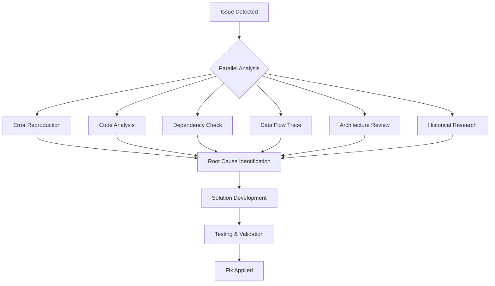

# /debug Workflow Specification

> **Status:** 📋 PLANNED - This is a workflow specification, not an executable command yet.
>
> **Purpose:** Documents the design for a future /debug command with multi-angle parallel debugging approach.

---

## Purpose
Orchestrates comprehensive debugging through multiple specialist agents analyzing the problem from different angles simultaneously, providing faster and more thorough problem resolution.

## Usage
```
/debug                           # Debug current error/issue
/debug "TypeError at line 45"   # Debug specific error
/debug --file app.js            # Debug issues in specific file
/debug --trace                  # Include stack trace analysis
/debug --performance            # Focus on performance issues
```

## Multi-Angle Analysis Approach

### Angle 1: Error Reproduction
**Agent:** Agent Testing Engineer
- Reproduce the issue
- Identify exact conditions
- Create minimal test case
- Document steps to reproduce

### Angle 2: Code Analysis
**Agent:** Code Review Expert
- Analyze problem code
- Check for common patterns
- Review recent changes
- Identify code smells

### Angle 3: External Dependencies
**Agent:** Integration Specialist
- Check API connections
- Verify service availability
- Review authentication
- Analyze network issues

### Angle 4: Data Flow
**Agent:** Memory System Engineer
- Trace data flow
- Check data integrity
- Review state management
- Analyze persistence issues

### Angle 5: System Architecture
**Agent:** Agent Architecture Designer
- Review component interactions
- Check design patterns
- Identify architectural issues
- Analyze coupling problems

### Angle 6: Historical Context
**Agent:** Research Manager
- Search for similar issues
- Review documentation
- Check known bugs
- Find solutions from community

## Workflow Execution

```python
def execute_debug(issue_description, options={}):
    # Phase 1: Initial Analysis (Parallel)
    initial_analysis = parallel_execute([
        Task("Reproduce issue",
             agent="agent-testing-engineer",
             params={"issue": issue_description}),
        Task("Analyze code",
             agent="code-review-expert",
             params={"issue": issue_description}),
        Task("Check dependencies",
             agent="integration-specialist",
             params={"issue": issue_description})
    ])

    # Phase 2: Deep Investigation (Parallel)
    deep_investigation = parallel_execute([
        Task("Trace data flow",
             agent="memory-system-engineer",
             params={"context": initial_analysis}),
        Task("Review architecture",
             agent="agent-architecture-designer",
             params={"context": initial_analysis}),
        Task("Research solutions",
             agent="research-manager",
             params={"issue": issue_description})
    ])

    # Phase 3: Solution Development
    solution = Task("Develop fix",
                   agent="task-manager",
                   params={
                       "analysis": initial_analysis,
                       "investigation": deep_investigation
                   })

    # Phase 4: Validation
    validation = parallel_execute([
        Task("Test fix",
             agent="agent-testing-engineer",
             params={"solution": solution}),
        Task("Review fix",
             agent="code-review-expert",
             params={"solution": solution})
    ])

    return compile_debug_report(all_results)
```

## Debug Process Flow



## Output Format

```markdown
# Debug Report: [Issue Description]

## 🔍 Issue Summary
**Error Type**: [Type]
**Location**: [File:Line]
**Severity**: Critical | High | Medium | Low
**First Occurrence**: [Timestamp]

## 🎯 Root Cause
[Clear explanation of the root cause]

## 📊 Analysis Results

### Reproduction (Testing Engineer)
✅ Issue reproduced successfully
- Steps to reproduce: [Listed]
- Conditions required: [Listed]
- Frequency: [Always/Sometimes/Rare]

### Code Analysis (Code Review Expert)
⚠️ Issues found:
- [Issue 1 with code reference]
- [Issue 2 with code reference]

### Dependencies (Integration Specialist)
✅ All external services operational
⚠️ Rate limiting detected on API X

### Data Flow (Memory System Engineer)
❌ Data corruption at step 3
- Input: [Data]
- Expected: [Data]
- Actual: [Data]

### Architecture (Architecture Designer)
⚠️ Coupling issue between components A and B
- Recommendation: [Refactoring suggestion]

### Historical Context (Research Manager)
📚 Similar issues found:
- Issue #123: [Description] - [Solution]
- Stack Overflow: [Link] - [Solution]

## 💡 Solution

### Immediate Fix
```javascript
// Current problematic code
[problematic code]

// Fixed code
[solution code]
```

### Long-term Improvements
1. [Improvement 1]
2. [Improvement 2]
3. [Improvement 3]

## ✅ Validation Results
- Unit Tests: ✅ Passing
- Integration Tests: ✅ Passing
- Performance Impact: Negligible
- Security Review: ✅ No issues

## 📋 Action Items
- [x] Identify root cause
- [x] Develop solution
- [x] Test fix
- [ ] Deploy to staging
- [ ] Monitor for recurrence
- [ ] Update documentation

## 🚀 Next Steps
1. Apply fix: `/apply-fix`
2. Run full test suite: `/test-all`
3. Deploy: `/deploy --staging`
4. Monitor: `/monitor --watch [component]`
```

## Debug Strategies

### Performance Issues
```
/debug --performance
```
- CPU profiling
- Memory analysis
- Database query optimization
- Network latency investigation

### Security Issues
```
/debug --security
```
- Vulnerability scanning
- Authentication review
- Authorization check
- Data exposure analysis

### Integration Issues
```
/debug --integration
```
- API testing
- Connection verification
- Timeout analysis
- Rate limit check

### Data Issues
```
/debug --data
```
- Data validation
- Schema verification
- Consistency check
- Corruption detection

## Advanced Features

### Time Travel Debugging
- Analyze state at different points
- Compare working vs broken states
- Track changes over time

### Comparative Debugging
- Compare with working version
- Diff analysis
- Configuration comparison

### Automated Fix Suggestions
- AI-powered solution generation
- Multiple fix alternatives
- Risk assessment for each fix

## Success Metrics

- Root cause identified: Yes/No
- Time to resolution: [minutes]
- Fix effectiveness: [percentage]
- Regression prevention: [measures added]

## Related Commands

- `/apply-fix` - Apply the suggested fix
- `/test-fix` - Test the fix in isolation
- `/rollback` - Revert recent changes
- `/monitor` - Set up monitoring for the issue