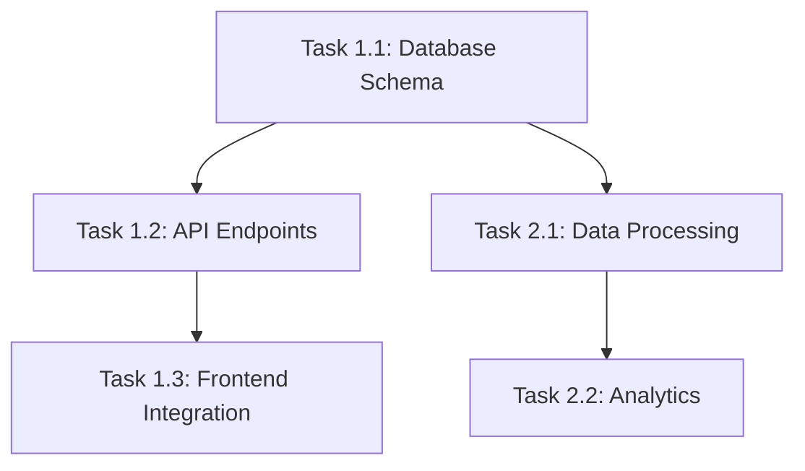

# The Execution: [Project Name]

**Created:** [Date]
**Phase:** 3 - Execution Planning
**Status:** Draft → Review Board → Approved
**Vision Document:** [[01-vision|The Vision]]
**Mission Document:** [[02-mission|The Mission]]

---

## 🧭 Project Navigation

- [[02-mission|← Phase 2: Mission]] | **Phase 3: Execution (You Are Here)** | [[03-review-board|Phase 3.5: Review Board]] → [[04-implementation|Phase 4: Implementation]]
- [[research/README|📚 Research]] | [[examples/README|💡 Examples]] | [[review/review-checklist|✅ Review Status]]
- [[agent-notes/communication-log|Agent Communications]] | [[agent-notes/decisions-log|Decisions Log]]

---

## Executive Summary

### Project Type & Complexity
**Type:** [Web App / API / Data Pipeline / ML System / etc.]
**Complexity:** [Simple / Medium / Complex]
**Estimated Duration:** [X weeks] (includes 25% buffer)

### Success Criteria from Vision
1. [Goal 1 from Vision]
2. [Goal 2 from Vision]
3. [Goal 3 from Vision]

### Key Deliverables
- [Deliverable 1]
- [Deliverable 2]
- [Deliverable 3]

---

## Agent Team Composition

We've identified the following agent teams for this project:

### Foundation Team
**Activated:** Yes / No
**Members:**
- database-architect (if data-heavy)
- devops-engineer (if infrastructure needed)

**Responsibilities:**
- Database schema design & optimization
- CI/CD pipeline setup
- Infrastructure provisioning
- Deployment automation

**Estimated Load:** [X%]

### Backend Team
**Activated:** Yes / No
**Members:**
- backend-developer
- api-architect (if API-heavy)
- sql-specialist (if complex queries)

**Responsibilities:**
- Core business logic
- API endpoints
- Data processing
- Backend services

**Estimated Load:** [X%]

### Frontend Team
**Activated:** Yes / No
**Members:**
- frontend-developer
- ui-ux-designer

**Responsibilities:**
- User interface implementation
- User experience design
- Frontend architecture
- Component library

**Estimated Load:** [X%]

### Research Team
**Activated:** Yes / No
**Members:**
- research-manager
- documentation-expert
- [Additional specialists if needed]

**Responsibilities:**
- Ongoing technical research
- Documentation creation
- Knowledge capture
- Best practices validation

**Estimated Load:** [X%]

### Quality Team
**Activated:** Yes (ALWAYS)
**Members:**
- qa-engineer
- code-review-expert
- security-auditor (if security-critical)
- performance-engineer (if performance-critical)

**Responsibilities:**
- Test strategy & execution
- Code review orchestration
- Security scanning
- Performance optimization

**Estimated Load:** [X%]

### Integration Team
**Activated:** Yes / No
**Members:**
- integration-specialist
- mcp-bridge-engineer (if using MCP)

**Responsibilities:**
- Third-party API integration
- Webhook implementation
- MCP server setup
- External service coordination

**Estimated Load:** [X%]

### Orchestration Team
**Activated:** Yes (ALWAYS)
**Members:**
- task-manager
- project-task-planner

**Responsibilities:**
- Planning & coordination
- Progress tracking
- Blocker resolution
- Team synchronization

**Estimated Load:** N/A (always active)

---

## Work Breakdown Structure

### Epic 1: [Epic Name]

**Priority:** P0
**Vision Goal Alignment:** [Which Vision goal(s) this epic achieves]
**Estimated Duration:** [X days]
**Agent Team:** [Which team(s) handle this]

#### Dependencies

**Technical Dependencies:**
- [Module/code dependencies]

**Information Dependencies:**
- [ ] API documentation from research team
- [ ] Code examples from research team
- [ ] Design specifications from ui-ux-designer
- [ ] Best practices from standards-researcher

**Resource Dependencies:**
- [ ] Database provisioned
- [ ] API keys obtained
- [ ] Development environment ready
- [ ] CI/CD pipeline configured

**Team Dependencies:**
1. Research Team completes [research] →
2. Backend Team builds [API] →
3. Frontend Team integrates →
4. Quality Team validates

#### Features

**Feature 1.1: [Feature Name]**

**Tasks:**

**Task 1.1.1: [Task Name]**
- **Description:** [Clear, actionable description]
- **Assigned To:** [agent-name] ([Team])
- **Estimated Effort:**
  - Optimistic: [X hours]
  - Realistic: [Y hours] (+25% buffer)
  - Pessimistic: [Z hours]
- **Dependencies:** [Task IDs or "None"]
- **Success Criteria:**
  - [ ] [Specific, measurable criterion]
  - [ ] [Specific, measurable criterion]
- **Quality Gate:** Task-level (unit tests, linting, self-review)

**Task 1.1.2: [Task Name]**
- **Description:**
- **Assigned To:** [agent-name] ([Team])
- **Estimated Effort:**
  - Optimistic: [X hours]
  - Realistic: [Y hours]
  - Pessimistic: [Z hours]
- **Dependencies:** [Task IDs]
- **Success Criteria:**
  - [ ] [Criterion]
  - [ ] [Criterion]
- **Quality Gate:** Task-level

**Feature 1.2: [Feature Name]**

[Continue feature breakdown]

#### Epic 1 Quality Gates

**Feature-Level Gates:**
- [ ] All tasks completed
- [ ] Integration tests passing
- [ ] Code reviewed by code-review-expert
- [ ] Documentation updated

**Epic-Level Gates:**
- [ ] All features completed
- [ ] E2E tests passing
- [ ] Performance benchmarks met
- [ ] Security scan clean (if applicable)
- [ ] UX review complete (if UI involved)

#### Epic 1 Risk Assessment

| Risk | Likelihood | Impact | Mitigation Strategy |
|------|-----------|--------|---------------------|
| [Risk 1] | High/Medium/Low | High/Medium/Low | [Mitigation plan] |
| [Risk 2] | High/Medium/Low | High/Medium/Low | [Mitigation plan] |

---

### Epic 2: [Epic Name]

[Repeat epic structure]

---

## Timeline & Buffer Calculation

### Overall Timeline

**Total Optimistic Estimate:** [X hours]
**Complexity Buffer (+25%):** [Y hours]
**Cross-Team Coordination Buffer (+10%):** [Z hours]
**Total Realistic Estimate:** [Total hours]

**Estimated Project Duration:** [X weeks/months]
- **Phase 4 (Implementation):** [X weeks]
- **Phase 5 (Testing):** [Y weeks]

### Critical Path

The following tasks are on the critical path (any delay impacts final delivery):

1. **Epic 1, Task 1.1** - [X days] - [Agent/Team]
2. **Epic 1, Task 1.3** - [Y days] - [Agent/Team]
3. **Epic 2, Task 2.1** - [Z days] - [Agent/Team]

**Total Critical Path Duration:** [X days]
**With Buffer:** [Y days] (recommended project timeline)

---

## Dependency Map (All 4 Types)

### Technical Dependency Graph



### Information Dependency Checklist

**Before Implementation Starts:**
- [ ] All research from Phase 2 Mission accessible
- [ ] API documentation reviewed
- [ ] Code examples saved and analyzed
- [ ] Design specifications approved
- [ ] Best practices documented
- [ ] Coding standards defined

### Resource Dependency Checklist

**Before Implementation Starts:**
- [ ] Development environment set up and tested
- [ ] Staging environment ready
- [ ] CI/CD pipeline configured
- [ ] Database provisioned (if needed)
- [ ] API keys obtained (if needed)
- [ ] Third-party service accounts created (if needed)
- [ ] Monitoring and logging configured

### Team Dependency Flow

```
Phase: Epic 1

1. Research Team (Week 1)
   ↓ hands off research to
2. Backend Team (Week 2-3)
   ∥ parallel with
3. Frontend Team (Week 2-3)
   ↓ both hand off to
4. Integration Team (Week 4)
   ↓ hands off to
5. Quality Team (Week 4-5)
```

---

## Quality Gates Throughout

### Task-Level Gates (Every Task)
**Before marking task "done":**
- [ ] Code written and committed
- [ ] Unit tests written and passing
- [ ] Linting passing
- [ ] Self-reviewed using checklist
- [ ] TodoWrite status updated

### Feature-Level Gates (Every Feature)
**Before closing feature:**
- [ ] All tasks in feature completed
- [ ] Integration tests passing
- [ ] Code reviewed by code-review-expert
- [ ] Documentation updated
- [ ] No critical bugs

### Epic-Level Gates (Every Epic)
**Before closing epic:**
- [ ] All features in epic completed
- [ ] E2E tests passing
- [ ] Performance benchmarks met
- [ ] Security scan clean
- [ ] UX review complete (if UI involved)
- [ ] Maps to Vision goal(s)

### Phase-Level Gates (Before Phase 5)
**Before declaring Phase 4 complete:**
- [ ] All epics completed
- [ ] Full system integration tested
- [ ] All quality gates passed
- [ ] Vision goals demonstrably achieved
- [ ] No critical blockers

---

## Communication & Handoff Protocols

### Team Sync Points

**Daily Async Sync (via Database/TodoWrite):**
- All agents update task status daily
- Blockers flagged immediately
- task-manager monitors progress

**Epic Kickoff Meeting:**
- When: Start of each new epic
- Participants: All agents assigned to epic
- Purpose: Align on goals, confirm dependencies, verify readiness

**Epic Retrospective:**
- When: Completion of each epic
- Participants: All agents who worked on epic
- Purpose: Review what went well, identify improvements

### Handoff Protocols

**Backend Team → Frontend Team:**
1. Backend Team completes API endpoints
2. Backend Team updates API documentation
3. Backend Team runs integration tests
4. Backend Team notifies Frontend Team via TodoWrite
5. Frontend Team verifies API contracts
6. Frontend Team confirms readiness to integrate
7. Handoff Status: COMPLETE

**Development Teams → Quality Team:**
1. Dev team completes feature
2. Dev team self-reviews using checklist
3. Dev team creates code-review-expert task
4. code-review-expert reviews and provides feedback
5. Dev team addresses feedback
6. code-review-expert approves
7. Handoff to qa-engineer for testing
8. Handoff Status: COMPLETE

### Blocker Escalation Process

**Level 1 - Agent identifies blocker:**
1. Document in TodoWrite with "BLOCKED" status
2. Attempt self-resolution (1 hour)

**Level 2 - Escalate to Team:**
3. Notify team lead (research-manager, qa-engineer, etc.)
4. Team attempts resolution (4 hours)

**Level 3 - Escalate to task-manager:**
5. task-manager assesses impact
6. If critical path: P0 priority
7. If multiple tasks blocked: P1 priority
8. Otherwise: P2 priority

**Level 4 - Cross-team coordination:**
9. task-manager coordinates cross-team solution
10. Updates all affected agents
11. Adjusts timeline if needed

---

## Execution Readiness Checklist

**Before Phase 4 Implementation Begins, ALL must be ✅:**

### Dependencies Ready
- [ ] All dependencies from Phase 2 Mission installed
- [ ] Package versions verified and documented
- [ ] Licenses checked and compliant
- [ ] No deprecated dependencies

### Access & Permissions
- [ ] All required agents identified and ready
- [ ] API keys obtained and stored securely
- [ ] Database credentials configured
- [ ] Third-party service accounts created
- [ ] Repository permissions granted
- [ ] Environment variables documented

### Environment Setup
- [ ] Development environment documented
- [ ] Development environment tested
- [ ] Staging environment ready
- [ ] CI/CD pipeline configured and tested
- [ ] Monitoring and logging setup
- [ ] Error tracking configured

### Tools & Services
- [ ] All required tools installed
- [ ] IDE configurations shared
- [ ] Linters and formatters configured
- [ ] Testing frameworks ready
- [ ] Build tools operational
- [ ] Deployment scripts tested

### Documentation Ready
- [ ] All research from Phase 2 accessible
- [ ] Code examples saved locally
- [ ] API documentation bookmarked
- [ ] Architecture diagrams available
- [ ] Coding standards documented
- [ ] Quality gate criteria defined

### Agent Team Prepared
- [ ] All needed agent teams identified above
- [ ] Agent roles and responsibilities clear
- [ ] Communication channels established
- [ ] Handoff protocols agreed upon
- [ ] task-manager ready to orchestrate
- [ ] First sprint tasks defined

### First Tasks Ready
- [ ] Sprint 1 tasks identified
- [ ] Initial assignments made
- [ ] No blockers for Day 1 work
- [ ] Success criteria clear
- [ ] "Done" definition agreed upon

**Overall Readiness:** [✅ READY TO START / ⚠️ NEEDS WORK]

**If NOT ready, gaps identified:**
- Missing: [list]
- Blockers: [list]
- Action items before Phase 4: [list]

---

## Review Board Preparation (Phase 3.5)

This execution plan will be reviewed by the C-Suite Review Board (CIO, CTO, COO) before Phase 4 begins.

### Pre-Validation Checklist

**CIO Criteria (Research & Dependencies):**
- [ ] All research from Phase 2 Mission referenced
- [ ] All 4 dependency types mapped (technical, information, resource, team)
- [ ] Code examples linked and analyzed
- [ ] Documentation sources cited
- [ ] Information dependencies explicitly clear
- [ ] Dependency versions specified

**CTO Criteria (Technical Architecture):**
- [ ] Code quality standards defined (linting rules, test coverage %)
- [ ] API contracts documented (if applicable)
- [ ] Performance testing planned (if applicable)
- [ ] Security audits scheduled (if applicable)
- [ ] Technical review gates set (feature-level, epic-level)
- [ ] Architecture diagrams included (if complex)

**COO Criteria (Operations & Execution):**
- [ ] Each epic mapped to Vision goals
- [ ] Timeline includes 20-30% buffer
- [ ] Agent capacity validated (no agent >80% utilized)
- [ ] UX/UI tasks included (if user-facing)
- [ ] Polish and "delight factors" planned
- [ ] Execution readiness verified

**Overall Pre-Validation:** [✅ READY FOR REVIEW BOARD / ⚠️ NEEDS WORK]

### Review Board References

**Research Quality (for CIO):**
- Research documents: [links to Phase 2 research]
- Code examples: [links to examples folder]
- Dependency sources: [package URLs, versions]

**Technical Soundness (for CTO):**
- Code quality standards: [link to standards doc]
- API contracts: [link to API specs]
- Performance targets: [benchmarks defined]
- Security measures: [security checklist]

**Operational Excellence (for COO):**
- Vision goal mapping: [See Epic sections above]
- Timeline buffer: [X% included]
- Agent utilization: [See Team Composition section]
- UX quality: [UI/UX tasks in epics]

---

## Progress Tracking & Metrics

### Definition of Done

**A task is "done" when:**
- [ ] Code implemented and committed
- [ ] Tests written and passing (unit + integration)
- [ ] Code reviewed and approved
- [ ] Documentation updated
- [ ] Deployed to dev/staging environment
- [ ] Task-level quality gate passed

**A feature is "done" when:**
- [ ] All tasks completed
- [ ] Feature-level quality gate passed
- [ ] No critical bugs

**An epic is "done" when:**
- [ ] All features completed
- [ ] Epic-level quality gate passed
- [ ] Vision goal(s) demonstrably achieved

### Status Reporting Cadence

- **Real-time:** TodoWrite status updates as tasks progress
- **Daily:** Async sync via database (what done, what in progress, blockers)
- **Weekly:** task-manager status report to user
- **Epic Completion:** Retrospective + lessons learned

### Key Performance Indicators

| KPI | Target | Tracking Method |
|-----|--------|----------------|
| Tasks Completed On-Time | >85% | TodoWrite timestamps |
| Quality Gate Pass Rate | >95% | Quality gate logs |
| Blocker Resolution Time | <4 hours | Blocker escalation log |
| Code Review Turnaround | <24 hours | code-review-expert metrics |
| Estimation Accuracy | ±20% | Actual vs estimated comparison |

---

## Next Steps

**Upon Execution Plan Approval:**

1. **Phase 3.5: Review Board**
   - task-manager presents plan to CIO, CTO, COO
   - C-suite reviews and provides verdict
   - IF APPROVED → Proceed to Phase 4
   - IF REJECTED → Revise plan, re-submit

2. **Phase 4: Implementation Kickoff**
   - Brief all agent teams on assignments
   - Initialize TodoWrite with all tasks
   - Establish communication channels
   - Verify execution readiness checklist
   - Begin Epic 1

3. **During Phase 4:**
   - task-manager orchestrates all agent teams
   - Enforce quality gates at every level
   - Track progress via TodoWrite + database
   - Handle blockers via escalation process
   - Hold epic retrospectives for continuous improvement

4. **Phase 5: Testing**
   - Comprehensive test plan execution
   - Final quality validation
   - Vision goal verification

---

## Review & Approval

**Execution Plan Created By:**
- project-task-planner (planning & breakdown)
- task-manager (orchestration & coordination)
- [Domain specialists consulted: list]

**Review Status:**
- **User Review:** [[review/review-checklist#phase-3|⏳ Pending]]
- **Review Board (Phase 3.5):** Pending
  - CIO Verdict: Pending
  - CTO Verdict: Pending
  - COO Verdict: Pending
  - Overall: Pending

**User Feedback:** [[review/feedback#phase-3|Add feedback here]]
**User Approval Date:** [Date]
**Review Board Approval Date:** [Date]

---

**Related Documents:**
- [[01-vision|Vision]] - What we're building & why
- [[02-mission|Mission]] - Technical research & dependencies
- [[03-review-board|Review Board Report]] - C-suite evaluation (Phase 3.5)
- [[04-implementation-report|Implementation Report]] - Build progress (Phase 4)
- [[05-test-plan|Test Plan]] - Validation strategy (Phase 5)
- [[agent-notes/communication-log|Agent Communications]] - Real-time updates
- [[review/review-checklist|Review Checklist]] - Approval tracking

**Note:** This plan is living. Update as execution progresses, discoveries are made, or Review Board provides feedback.
