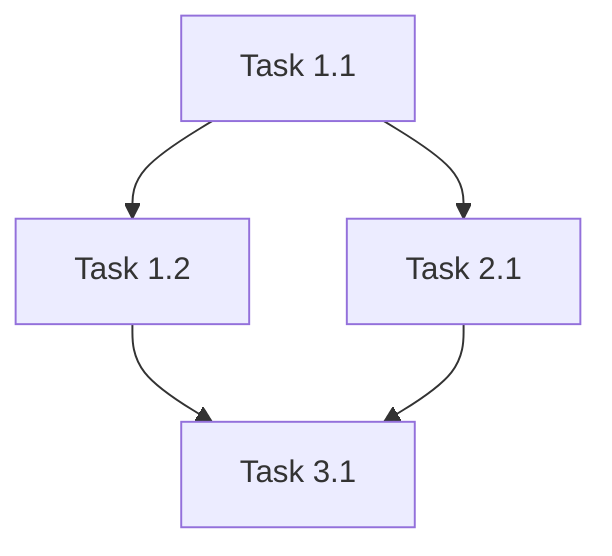

# The Execution: [Project Name]

**Created:** [Date]
**Phase:** 3 - Execution Planning
**Status:** Draft
**Vision Document:** [[01-vision|The Vision]]
**Mission Document:** [[02-mission|The Mission]]

---

## 🧭 Project Navigation

- [[02-mission|← Phase 2: Mission]] | **Phase 3: Execution (You Are Here)** | Phase 4: Execute →
- [[research/README|📚 Research]] | [[examples/README|💡 Examples]] | [[review/review-checklist|✅ Review Status]]
- [[agent-notes/communication-log|Agent Communications]] | [[agent-notes/decisions-log|Decisions Log]]

---

## Execution Overview

### Timeline Summary
**Start Date:** [Date]
**Target Completion:** [Date]
**Total Duration:** [X weeks/months]

### Team Structure

| Role | Agent | Availability | Primary Responsibilities |
|------|-------|--------------|--------------------------|
|      |       |              |                          |

## Work Breakdown Structure

### Epic 1: [Name]
**Priority:** P0/P1/P2
**Est. Duration:** [X days/weeks]
**Dependencies:** None / [List]

#### Task 1.1: [Task Name]
- **Description:**
- **Assigned Agent:** [agent-name]
- **Est. Effort:** [X hours/days]
- **Dependencies:** [Task IDs]
- **Success Criteria:**
  - [ ]
  - [ ]
- **Resources Needed:**

#### Task 1.2: [Task Name]
- **Description:**
- **Assigned Agent:** [agent-name]
- **Est. Effort:** [X hours/days]
- **Dependencies:** [Task IDs]
- **Success Criteria:**
  - [ ]
  - [ ]

### Epic 2: [Name]
**Priority:** P0/P1/P2
**Est. Duration:** [X days/weeks]
**Dependencies:** [Epic IDs]

#### Task 2.1: [Task Name]
- **Description:**
- **Assigned Agent:** [agent-name]
- **Est. Effort:** [X hours/days]
- **Dependencies:** [Task IDs]
- **Success Criteria:**
  - [ ]
  - [ ]

## Dependency Graph

## Agent Assignment Matrix

| Agent | Role | Tasks | Capacity (%) | Parallel Capable |
|-------|------|-------|--------------|------------------|
| code-review-expert | Quality | [Task IDs] | 30% | Yes |
| integration-specialist | APIs | [Task IDs] | 50% | No |
| documentation-expert | Docs | [Task IDs] | 20% | No |
| agent-testing-engineer | Testing | [Task IDs] | 40% | Yes |

## Sprint/Milestone Plan

### Milestone 1: [Name] - [Date]
**Goal:** [Description]

**Sprint 1** ([Dates])
- Tasks: [List]
- Deliverables: [List]
- Agent Focus: [List]

**Sprint 2** ([Dates])
- Tasks: [List]
- Deliverables: [List]
- Agent Focus: [List]

### Milestone 2: [Name] - [Date]
**Goal:** [Description]

**Sprint 3** ([Dates])
- Tasks: [List]
- Deliverables: [List]
- Agent Focus: [List]

## Parallel Execution Opportunities

### Parallel Stream 1
**Tasks:** [IDs]
**Agents:** [List]
**Coordination:** [Who orchestrates]

### Parallel Stream 2
**Tasks:** [IDs]
**Agents:** [List]
**Coordination:** [Who orchestrates]

## Critical Path

The following tasks are on the critical path (delays impact final delivery):

1. Task [ID]: [Name] - [Duration]
2. Task [ID]: [Name] - [Duration]
3. Task [ID]: [Name] - [Duration]

**Total Critical Path Duration:** [X days]

## Resource Requirements

### Development Environment
-

### Tools & Services
| Tool | Purpose | Setup Required |
|------|---------|----------------|
|      |         |                |

### Access & Permissions
| Resource | Who Needs Access | How to Request |
|----------|------------------|----------------|
|          |                  |                |

## Communication & Coordination

### Daily Sync
**Time:** [Time]
**Participants:** [Agents]
**Format:** [Description]

### Handoff Protocol

#### From Agent A to Agent B:
1. Step 1
2. Step 2
3. Verification

#### From Agent C to Agent D:
1. Step 1
2. Step 2
3. Verification

### Blocker Resolution Process
1. Identify blocker
2. Document in [location]
3. Escalate to task-manager
4. Resolution tracking

## Risk Management Plan

| Risk | Mitigation | Contingency | Owner |
|------|------------|-------------|-------|
|      |            |             |       |

## Quality Gates

### Gate 1: Post-Development
- [ ] All unit tests passing
- [ ] Code review completed
- [ ] Documentation updated
- [ ] No critical bugs

### Gate 2: Pre-Integration
- [ ] Integration tests passing
- [ ] API contracts validated
- [ ] Performance benchmarks met
- [ ] Security scan clean

### Gate 3: Pre-Deployment
- [ ] E2E tests passing
- [ ] Load testing completed
- [ ] Monitoring configured
- [ ] Rollback plan ready

## Progress Tracking

### Definition of Done
A task is considered "done" when:
- [ ] Code implemented and committed
- [ ] Tests written and passing
- [ ] Code reviewed and approved
- [ ] Documentation updated
- [ ] Deployed to dev/staging environment

### Status Reporting
- **Daily:** Task status updates in TodoWrite
- **Weekly:** Progress report to task-manager
- **Milestone:** Comprehensive status document

## Monitoring & Metrics

### Key Performance Indicators
| KPI | Target | Current | Status |
|-----|--------|---------|--------|
|     |        |         |        |

### Velocity Tracking
- Sprint 1: [X tasks completed]
- Sprint 2: [X tasks completed]
- Sprint 3: [X tasks completed]

## Next Steps

**Upon Execution Plan Approval:**
1. Proceed to Phase 4: Execute
2. Activate all assigned agents
3. Initialize TodoWrite with all tasks
4. Begin Sprint 1
5. Track agent communications in [[agent-notes/communication-log|Communication Log]]
6. Document key decisions in [[agent-notes/decisions-log|Decisions Log]]

**Phase 4 Kickoff:**
- [ ] Environment setup verified
- [ ] All agents briefed
- [ ] Dependencies from [[research/dependencies|Dependencies]] installed
- [ ] First tasks assigned
- [ ] Examples from [[examples/README|Examples folder]] reviewed

---

## Review & Approval

**Execution Plan Author:** Claude Code (project-task-planner, task-manager)
**Review Status:** [[review/review-checklist#phase-3|⏳ Pending User Review]]
**User Feedback:** [[review/feedback#phase-3|Add feedback here]]
**Approval Date:**

---

**Related Documents:**
- [[01-vision|Vision]] - What we're building
- [[02-mission|Mission]] - How we'll build it
- [[04-test-plan|Test Plan]] - How we'll validate (Phase 5)
- [[agent-notes/communication-log|Agent Communications]] - Real-time updates
- [[review/review-checklist|Review Checklist]] - Approval tracking

**Note:** This plan is a living document. Update as execution progresses and adjust based on actual progress and discoveries.